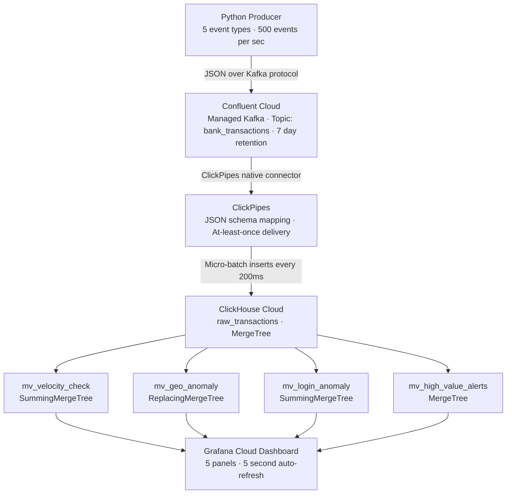

# Real-Time Fraud Detection Intelligence Platform

A cloud-native streaming pipeline that detects banking fraud in real time using Apache Kafka, ClickPipes, ClickHouse Cloud, and Grafana. The pipeline streams approximately 500 banking events per second and surfaces fraud alerts on a live dashboard in under one second end-to-end.

---

## What This Project Does

Traditional fraud detection systems rely on batch processing which is too slow to catch fraud as it happens. This project solves that by building a fully streaming pipeline where every banking event is ingested, analyzed, and flagged the moment it arrives.

Five types of banking events are streamed continuously through Kafka into ClickHouse, where four Materialized Views run fraud detection logic automatically on every insert. A Grafana dashboard refreshes every five seconds to surface active fraud signals across all accounts.

---

## Architecture


---

## Tech Stack

| Tool | Role | Hosting |
|---|---|---|
| Python + confluent-kafka | Produces 5 banking event types at ~500 events per second | Local machine |
| Confluent Cloud | Managed Kafka cluster hosting the bank_transactions topic | Cloud (free trial) |
| ClickPipes | Native ClickHouse connector with no custom consumer code or middleware | ClickHouse Cloud UI |
| ClickHouse Cloud | Core analytics engine with MergeTree storage and Materialized Views | Cloud (free trial) |
| Grafana Cloud | Live dashboard with 5 panels and 5-second auto-refresh | Cloud (free tier) |
| Faker | Generates realistic synthetic banking data for the producer | Local machine |

---

## Event Types

The producer simulates five banking event types across 200 accounts:

- `purchase_event` — card swipe at a merchant with location and amount
- `atm_withdrawal` — cash withdrawal with GPS coordinates
- `online_transfer` — account-to-account fund movement
- `login_attempt` — authentication event with device, IP, and location metadata
- `account_update` — changes to contact details or linked accounts

---

## Fraud Detection Patterns

| Pattern | Engine | Logic | Threshold |
|---|---|---|---|
| Velocity Anomaly | SummingMergeTree | Transaction count per account per 5-minute window | More than 5 transactions |
| Geo Anomaly | ReplacingMergeTree | Latest country per account — flags country change within 1 hour | Different country detected |
| Login Anomaly | SummingMergeTree | Failed login count per account per hour | More than 3 failed attempts |
| High Value Alert | MergeTree | Single transaction amount filter on insert | Amount above $5,000 |

Each pattern is implemented as a Materialized View that fires automatically on every insert into the raw_transactions table. No fraud query ever touches the raw table directly.

---

## ClickHouse Schema

```sql
CREATE TABLE raw_transactions (
    event_id    String,
    account_id  String,
    event_type  LowCardinality(String),
    amount      Decimal(18,2),
    merchant    String,
    country     LowCardinality(String),
    city        String,
    device_id   String,
    ip_address  String,
    status      LowCardinality(String),
    event_time  DateTime
) ENGINE = MergeTree()
PARTITION BY toYYYYMMDD(event_time)
ORDER BY (account_id, event_time);
```

---

## Project Structure

| Path | Description |
|---|---|
| `producer/producer.py` | Kafka producer script that streams all 5 event types |
| `sql/01_mv_velocity_check.sql` | SummingMergeTree — transaction count per 5-minute window |
| `sql/02_mv_geo_anomaly.sql` | ReplacingMergeTree — latest country per account |
| `sql/03_mv_login_anomaly.sql` | SummingMergeTree — failed login count per hour |
| `sql/04_mv_high_value_alerts.sql` | MergeTree — transactions above $5,000 |
| `queries/velocity_anomaly.sql` | Flags accounts with more than 5 transactions in 5 minutes |
| `queries/login_anomaly.sql` | Flags accounts with more than 3 failed logins per hour |
| `queries/high_value_alerts.sql` | Surfaces all transactions above $5,000 in the last 30 minutes |
| `queries/composite_risk_score.sql` | Joins all 4 signals into a single ranked risk view |

---

## Setup

### Prerequisites

- Confluent Cloud account (free trial at confluent.io)
- ClickHouse Cloud account (free trial at clickhouse.com)
- Grafana Cloud account (free at grafana.com)
- Python 3.8 or higher

### Install dependencies

```bash
pip install confluent-kafka faker
```

### Configure credentials

Open `producer/producer.py` and update the following:

```python
BOOTSTRAP_SERVER = "your-confluent-bootstrap-server:9092"
API_KEY          = "your-cluster-scoped-api-key"
API_SECRET       = "your-cluster-api-secret"
```

Use a cluster-scoped API key from the Confluent cluster page, not a global key.

### Run the producer

```bash
python producer/producer.py
```

### Set up ClickPipes

In ClickHouse Cloud go to Data Sources, create a new ClickPipe, select Confluent Cloud, enter your bootstrap server and API credentials, select the bank_transactions topic, map the schema, and create the pipe.

### Run the SQL

Execute the files in the `sql/` folder in order to create the four Materialized Views, then run the queries in `queries/` to validate fraud detection against live data.

---

## Results

| Metric | Result |
|---|---|
| Producer throughput | ~320 events per second sustained |
| Events ingested | 34,000+ rows within minutes of starting |
| Velocity query time | 0.004 seconds against live streaming data |
| Login anomaly query time | 0.004 seconds |
| High value query time | 0.005 seconds across 6,511 rows |
| Composite risk score | 0.012 seconds joining all four signal sources |
| End-to-end latency | Under 1 second from producer to Grafana dashboard |

---

## Author

**Hariharan Ramesh**  
Business Intelligence Analyst · MS Business Analytics
